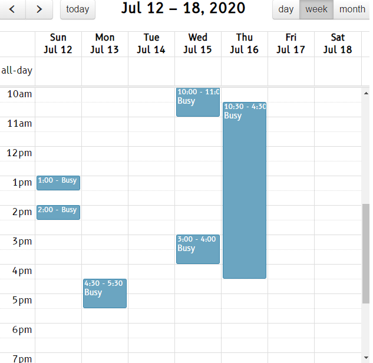
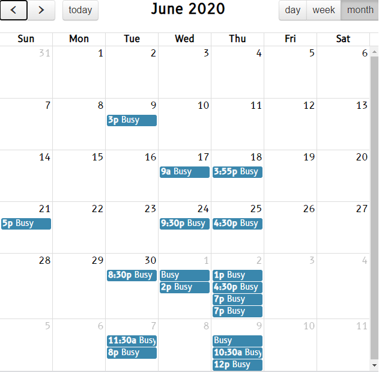

# icalviewer
Combined view of calendars given iCal link 

## Make a config file
Example: `config.json`
```json
[
    {
        "hideInfo": true,
        "isPublicGoogle": false,
        "url": "https://calendar.google.com/calendar/ical/username%40gmail.com/private-TOKEN/basic.ics"
    },
    {
        "hideInfo": true,
        "isPublicGoogle": false,
        "url": "https://outlook.office365.com/owa/calendar/TOKEN@outlook.com/TOKEN/TOKEN/reachcalendar.ics"
    },
    {
        "hideInfo": false,
        "isPublicGoogle": true,
        "url": "https://calendar.google.com/calendar/embed?src=iw.jewish%23holiday%40group.v.calendar.google.com&ctz=Asia%2FJerusalem"
    }
]
```

## Run docker
You need to:
1. mount `config.json`
2. map a port to 3000

Example:

```bash
docker run --rm -it -p 3000:3000 -v $(pwd)/config.json:/src/app/config.json ical
```

## Result
Navigate to `http://localhost:3000/calendarview/index.html` for the result.

## Example Result



